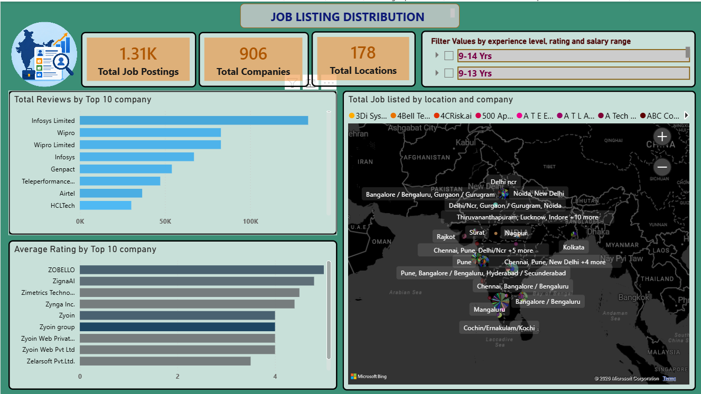
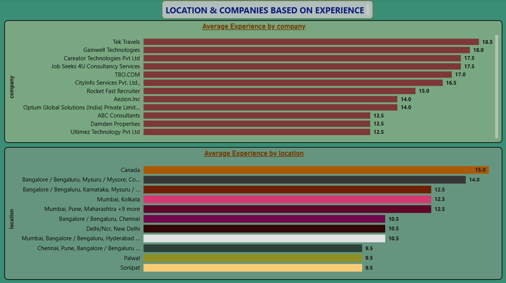

# Job Market Insights & Talent Trends Dashboard

💼 Project Overview

This project presents an end-to-end data analytics solution designed to analyze job market trends, company rating distributions, and geographic demand across various experience levels. By aggregating job posting data, the project transforms raw listings into actionable business intelligence for market research and strategic talent acquisition.

🛠️ Tech Stack & Tools

Data Processing & ETL: Python (Pandas, NumPy)

Database & Querying: SQL (SQL Server) — Data cleaning, aggregation, and window functions

Data Visualization: Power BI (DAX, Interactive Slicers, Geospatial Mapping)

## In Python Performed:-

>Data cleaning|
>ETL process done|
>Data visualization|
>Bar plotting|
>Scatter plot|
>Histogram 2D plot|
>Hypothesis test|
>Regression plot|
>Download files (csv format)|
>Box plot|
>Removing Outliers|
>Label Encoding|
>Linear regression model build|
>Random Forest Regressor model build|
>R2 score|
>Mean_Squared_Error|

## Used SQL Queries:-

1.CTE table creation

2.Stored Procedure

3.view creation

4.Alter and Update

5.Trigger creation

6.case statement

## SQL TASKS:-

1.Find top 5 Companies which is having highest Average rating.

2.create a CTE table for Find the average base salary and average maximum salary for each location, and display only those locations where the average base salary is greater than certain amount.

3.Write a stored procedure to extract the minimum and maximum years of experience from the experience column and update the min_exp and max_exp columns in the      DataAnalystJobsIndia table.

4.create a Trigger table for inserting data into the Table.

5.Create a View named as 'vw_joblisting' where maximum salary and base salary is not null.

## 📊 Dashboard Overview

### 1. Job Listing Distribution & Overview

### 2. Location & Experience Analytics

🔑 Key Features & Analytics

Geospatial Demand Mapping: Interactive spatial visualization mapping job concentration across major metropolitan hubs.

Company & Experience Segmentation: Dynamic slicing across experience tiers to identify regional hiring density.

Review & Rating Analytics: Comparative evaluation of high-volume corporate recruiters versus niche tech firms.

Custom DAX Metrics: Calculated measures for average experience distributions, dynamic filtering, and score aggregations.

Actionable Business Insights ->
Extraction & Transformation (Python): Cleaned missing values, standardized location text, and normalized experience bracket fields.

Database Management (SQL): Stored structured data and executed complex queries using aggregations and CTEs to structure reporting tables.

Data Modeling & Visualization (Power BI): Designed schema relationships, built dynamic DAX measures, and crafted a visual layout tailored for executive reporting.

💡 Key Analytical Insights
Corporate Scale vs. Satisfaction: While large-scale recruiters dominate overall review volumes, specialized tech organizations consistently earn top average employee rating scores.

Experience Tier Concentration: Senior-level opportunities exhibit strong cluster patterns around core technology hubs rather than emerging markets.

Regional Specialization: Hiring markets demonstrate distinct experience expectations depending on geographical location and industry density.
